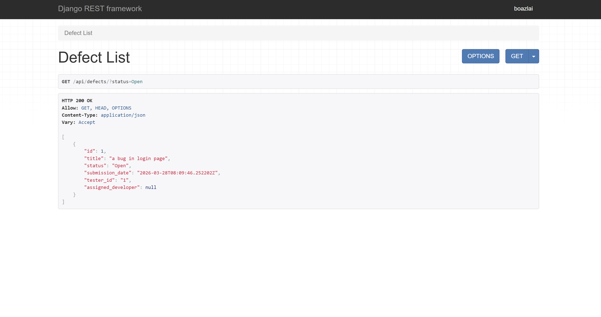
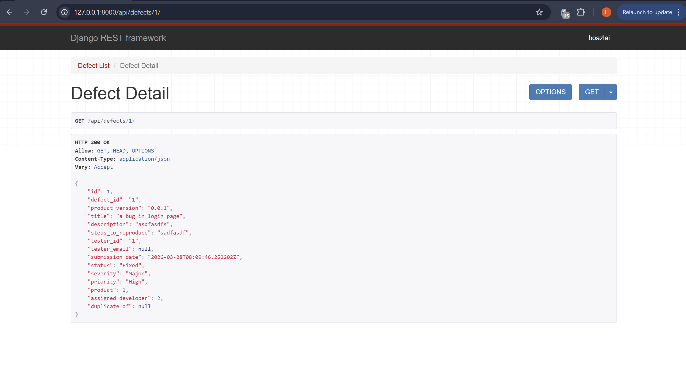

# COMP3297-BetaTrax

COMP3297 Group B Project - BetaTrax Implementation

## API Design

### Product Owner:

PATCH /api/defects/\<pk\>/accept/

**PowerShell:**

```powershell
Invoke-RestMethod -Method PATCH -Uri "http://127.0.0.1:8000/api/defects/1/accept/" `
  -Headers @{"Content-Type"="application/json"} `
  -Body '{"severity": "Major", "priority": "High"}'
```

**Linux/macOS (bash):**

```bash
curl -X PATCH http://127.0.0.1:8000/api/defects/1/accept/ \
  -H "Content-Type: application/json" \
  -d '{"severity": "Major", "priority": "High"}'
```

### Developer:

GET /api/defects/?status=Open



GET /api/defects/\<pk\>/

PATCH /api/defects/\<pk\>/assign/

**PowerShell:**

```powershell
Invoke-RestMethod -Method PATCH -Uri "http://127.0.0.1:8000/api/defects/1/assign/" `
  -Headers @{"Content-Type"="application/json"} `
  -Body '{"developer_id": 1}'
```

**Linux/macOS (bash):**

```bash
curl -X PATCH http://127.0.0.1:8000/api/defects/1/assign/ \
  -H "Content-Type: application/json" \
  -d '{"developer_id": 1}'
```

PATCH /api/defects/\<pk\>/fix/

**PowerShell:**

```powershell
Invoke-RestMethod -Method PATCH -Uri "http://127.0.0.1:8000/api/defects/1/fix/" `
  -Headers @{"Content-Type"="application/json"} `
  -Body '{}'
```

**Linux/macOS (bash):**

```bash
curl -X PATCH http://127.0.0.1:8000/api/defects/1/fix/ \
  -H "Content-Type: application/json" \
  -d '{}'
```


